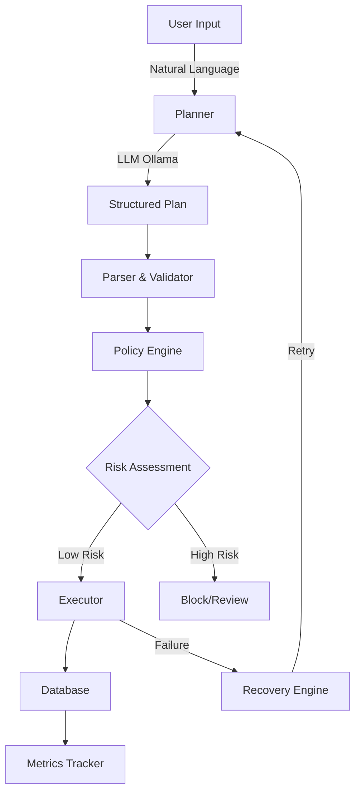

<div align="center">

# 🚀 NOVA

### Neural Orchestrated Virtual Assistant

**AI-Powered Local DevOps Automation Engine**

[](https://www.python.org/)
[](LICENSE)
[](CHANGELOG.md)

[Features](#-features) • [Quick Start](#-quick-start) • [Documentation](#-documentation) • [Architecture](#-architecture)

---

</div>

## 🎯 What is NOVA?

NOVA transforms **natural language** into **safe, executable workflows** — entirely on your machine.

```bash
nova run "create a FastAPI backend with Docker support"
```

It's an **offline-first**, **policy-governed** AI agent that:
- 🧠 **Understands** plain English instructions
- 📋 **Plans** structured execution steps using local LLM
- 🔐 **Validates** commands for safety before execution
- ⚡ **Executes** natively or in Docker sandbox
- 🔄 **Self-heals** from failures automatically
- 📊 **Tracks** metrics and risk scores

<div align="center">

### 🎬 See It In Action

```
You: "Setup a Python project with tests and CI"
    ↓
NOVA: Generates secure plan → Validates safety → Executes → Logs everything
    ↓
Result: Complete project structure with .github/, tests/, src/, README
```

</div>

---

## ✨ Features

<table>
<tr>
<td width="50%">

### 🧠 **Intelligent Planning**
- Natural language understanding
- Structured task decomposition
- Context-aware execution
- Local LLM (Ollama) integration

</td>
<td width="50%">

### 🔐 **Security First**
- Command whitelist enforcement
- Risk scoring system
- Policy-based decisions
- No sudo/destructive ops by default

</td>
</tr>
<tr>
<td width="50%">

### 🔄 **Self-Healing**
- Automatic error detection
- LLM-powered recovery
- Configurable retry limits
- State persistence & resume

</td>
<td width="50%">

### 📊 **Observability**
- PostgreSQL/SQLite persistence
- Session history tracking
- Metrics & analytics
- Risk management

</td>
</tr>
</table>

---

## 🚀 Quick Start

### Prerequisites

```bash
Python 3.11+  │  Git  │  (Optional: PostgreSQL, Ollama, Docker)
```

### Installation

```bash
# 1️⃣ Clone the repository
git clone https://github.com/yourusername/nova.git
cd nova

# 2️⃣ Create virtual environment
python3 -m venv venv
source venv/bin/activate  # Windows: venv\Scripts\activate

# 3️⃣ Install NOVA
pip install -e ".[dev]"

# 4️⃣ Initialize database
alembic upgrade head

# 5️⃣ Verify installation
nova doctor
```

### Your First Command

```bash
nova run "create a hello world Python script"
```

<details>
<summary>📦 <strong>Advanced Setup</strong> (PostgreSQL + Ollama)</summary>

```bash
# PostgreSQL (optional - SQLite used by default)
createdb nova_db
createuser nova_user -P

# Configure environment
cp .env.example .env
# Edit .env with your credentials

# Ollama for AI planning (optional)
brew install ollama  # or visit ollama.ai/download
ollama serve
ollama pull llama3

# Verify
nova doctor
```

</details>

---

## 📖 Usage

### Basic Commands

```bash
# Execute a task
nova run "your task description"

# View execution history
nova session --limit 10

# Resume failed workflow
nova resume <session_id>

# Environment check
nova doctor

# Show metrics
nova metrics
```

### Execution Modes

| Mode | Command | Description |
|------|---------|-------------|
| 🚀 **Normal** | `nova run "task"` | Full execution with safety checks |
| 🧪 **Simulate** | `nova run "task" --simulate` | Preview risk without execution |
| 📋 **Plan Only** | `nova run "task" --plan-only` | Show plan without policy checks |

### Example Workflows

<details>
<summary><strong>Create a FastAPI Backend</strong></summary>

```bash
nova run "create a FastAPI backend with:
  - main.py with health check endpoint
  - requirements.txt with fastapi and uvicorn
  - Dockerfile for containerization
  - .gitignore for Python projects"
```

</details>

<details>
<summary><strong>Initialize Git Repository</strong></summary>

```bash
nova run "initialize git repository with:
  - .gitignore for Python
  - initial commit with message 'Initial commit'
  - README.md with project description"
```

</details>

<details>
<summary><strong>Run Tests with Coverage</strong></summary>

```bash
nova run "run pytest with coverage report and save results to coverage.xml"
```

</details>

---

## 🏗️ Architecture

<div align="center">



</div>

### Component Overview

```
nova/
├── 🎮 controller/      # Orchestration & execution flow
├── 🧠 planner/         # Task planning & decomposition  
├── 🔐 policy/          # Security & risk management
├── 🔄 recovery/        # Failure handling & resumption
├── 📊 analytics/       # Metrics & analysis
├── 💾 database/        # PostgreSQL/SQLite persistence
├── ⚡ execution/       # Native & Docker executors
├── 🛡️ security/        # Command validation
├── 🔧 tools/           # Tool implementations
└── 📈 observability/   # Monitoring & tracking
```

<details>
<summary>📚 <strong>View Detailed Architecture</strong></summary>

### Data Flow

1. **Input Phase**: User provides natural language task
2. **Planning Phase**: Ollama LLM generates structured JSON plan
3. **Validation Phase**: Schema validation + tool normalization
4. **Security Phase**: Policy engine evaluates risk levels
5. **Execution Phase**: Commands run natively or in Docker
6. **Persistence Phase**: Results stored in database
7. **Recovery Phase**: Automatic retry on failures

### Security Layers

- ✅ Command whitelist enforcement
- ✅ Blocked operations (rm -rf, sudo, etc.)
- ✅ Risk scoring (low/high/critical)
- ✅ Operation limits based on risk history
- ✅ Execution timeouts (30s default)
- ✅ Optional Docker sandbox isolation

</details>

---

## 🔧 Configuration

### Environment Variables

```bash
# Database (optional - uses SQLite if not provided)
DB_HOST=localhost
DB_PORT=5432
DB_NAME=nova_db
DB_USER=nova_user
DB_PASSWORD=nova_password

# AI Planning (optional)
OLLAMA_URL=http://localhost:11434

# Execution
USE_SANDBOX=false  # true for Docker isolation
```

### Config File

Create `~/.nova/config.yaml`:

```yaml
# Database settings
db_host: localhost
db_port: 5432
db_name: nova_db

# LLM settings
ollama_url: http://localhost:11434
model: llama3

# Execution settings
use_sandbox: false
max_retries: 3
command_timeout: 30
```

📖 See [CONFIG_SYSTEM.md](CONFIG_SYSTEM.md) for advanced configuration.

---

## 🧪 Development

### Setup Development Environment

```bash
# Clone and install with dev dependencies
git clone https://github.com/yourusername/nova.git
cd nova
python3 -m venv venv
source venv/bin/activate
pip install -e ".[dev]"

# Install pre-commit hooks
pre-commit install
```

### Quality Checks

```bash
# Format code
make format

# Lint code
make lint

# Type checking
make type-check

# Run tests
make test

# Run tests with coverage
make test-cov

# Security scan
make security

# All CI checks
make ci-check
```

### Testing

```bash
# All unit tests
pytest tests -v

# Specific test file
pytest tests/test_parser.py -v

# With coverage report
pytest tests --cov=nova --cov-report=html

# Open coverage report
open htmlcov/index.html
```

### Project Commands

Run `make help` to see all available commands:

```
Setup:
  make install              Install production dependencies
  make install-dev          Install development dependencies
  
Development:
  make lint                 Run linting (flake8)
  make format               Format code (black, isort)
  make test                 Run unit tests
  make test-cov             Run tests with coverage
  
CI/CD:
  make ci-check             Run all CI checks locally
```

---

## 📊 Metrics & Risk Management

### Risk Scoring Formula

```
risk_score = (read_count × 1) + (write_count × 2) + (retry_count × 3)
```

### Adaptive Limits

- **Default Mode**: 4 operations per session
- **Strict Mode**: 2 operations (activated when avg risk > 8 in last 3 sessions)

### Monitoring

```bash
# View session metrics
nova session --limit 10

# Show system metrics
nova metrics

# AI-powered analysis
nova analyze

# Show retry attempts
nova retries

# Show failed steps
nova failures
```

---

## 🛡️ Security Model

NOVA enforces multiple security layers:

| Layer | Protection |
|-------|------------|
| 🚫 **Blocklist** | Prevents dangerous commands (rm -rf, sudo, shutdown) |
| 📋 **Schema Validation** | Ensures plan structure integrity |
| 🔍 **Risk Assessment** | Evaluates operation safety (low/high/critical) |
| ⏱️ **Timeouts** | 30-second execution limit per command |
| 🔄 **Retry Limits** | Maximum 3 retry attempts |
| 🐋 **Sandbox** | Optional Docker container isolation |
| 📊 **Operation Limits** | Risk-based adaptive throttling |

---

## 🐛 Troubleshooting

<details>
<summary><strong>❌ "ModuleNotFoundError: No module named 'click'"</strong></summary>

**Solution:**
```bash
source venv/bin/activate
pip install -e ".[dev]"
```

</details>

<details>
<summary><strong>❌ "Database connection failed"</strong></summary>

**Solution:** Use SQLite (easier) or fix PostgreSQL:
```bash
# Option 1: Remove .env (SQLite auto-used)
rm .env
alembic upgrade head

# Option 2: Fix PostgreSQL
createdb nova_db -U nova_user
alembic upgrade head
```

</details>

<details>
<summary><strong>❌ "Model 'llama3' not found"</strong></summary>

**Solution:**
```bash
# Install Ollama
brew install ollama  # or visit ollama.ai/download

# Start server
ollama serve

# Pull model
ollama pull llama3
```

</details>

<details>
<summary><strong>❌ "externally-managed-environment" error</strong></summary>

**Solution:** Always use virtual environment:
```bash
python3 -m venv venv
source venv/bin/activate
pip install -e ".[dev]"
```

</details>

<details>
<summary><strong>❌ Make commands reference old 'app/' directory</strong></summary>

**Solution:** You may have an old version. Pull latest:
```bash
git pull origin main
```

Or manually update Makefile to use `nova/` instead of `app/`.

</details>

---

## 📚 Documentation

| Document | Description |
|----------|-------------|
| [SETUP.md](SETUP.md) | 5-minute setup guide |
| [STRUCTURE.md](STRUCTURE.md) | Project architecture |
| [CONFIG_SYSTEM.md](CONFIG_SYSTEM.md) | Configuration guide |
| [DEVELOPMENT.md](DEVELOPMENT.md) | Development setup |
| [TESTING.md](TESTING.md) | Testing guide |
| [CHANGELOG.md](CHANGELOG.md) | Version history |

---

## 🎯 Use Cases

### DevOps Automation
- 🔧 Project scaffolding
- 🐳 Docker setup
- 🔄 CI/CD pipeline creation
- 📦 Dependency management

### Development Workflows
- ✅ Test execution
- 📝 Documentation generation
- 🎨 Code formatting
- 🔍 Security scanning

### Infrastructure
- 🗄️ Database migrations
- 🌐 API endpoint creation
- 📊 Monitoring setup
- 🔐 Security hardening

---

## 🛠️ Tech Stack

<div align="center">

| Category | Technologies |
|----------|-------------|
| **Language** | Python 3.11+ |
| **CLI** | Typer, Rich |
| **Database** | PostgreSQL, SQLite, SQLAlchemy 2.0, Alembic |
| **AI** | Ollama (local LLM) |
| **Execution** | Native, Docker |
| **Testing** | Pytest, Coverage |
| **Quality** | Black, isort, Flake8, MyPy, Bandit |
| **CI/CD** | GitHub Actions |

</div>

---

## 📈 Version History

### v0.1.3 - Current
- ✅ Shell operator support (`&&`, `||`, pipes)
- ✅ Automatic directory creation
- ✅ Tool validation in planner
- ✅ Session-based logging
- ✅ Crash-safe error handling
- ✅ Step-level persistence & resume
- ✅ Comprehensive test suite (54 tests)
- ✅ Security hardening
- ✅ Full CI/CD pipeline

### Recent Bug Fixes

**Makefile Migration Fix** (2026-10-03)
- Fixed Makefile references from `app/` to `nova/` after package restructuring
- Updated all development commands to work with new directory structure
- Enhanced documentation with Quick Start and Troubleshooting sections

See [CHANGELOG.md](CHANGELOG.md) for complete history.

---

## 🤝 Contributing

Contributions are welcome! Here's how to get started:

1. **Fork** the repository
2. **Create** a feature branch (`git checkout -b feature/amazing-feature`)
3. **Commit** your changes (`git commit -m 'Add amazing feature'`)
4. **Push** to the branch (`git push origin feature/amazing-feature`)
5. **Open** a Pull Request

### Development Setup

```bash
git clone https://github.com/yourusername/nova.git
cd nova
python3 -m venv venv
source venv/bin/activate
pip install -e ".[dev]"
pre-commit install
make test
```

### Code Quality

Before submitting:
```bash
make format  # Auto-format code
make lint    # Check linting
make test    # Run tests
make ci-check  # Run all CI checks
```

---

## 📄 License

This project is licensed under the **MIT License** - see the [LICENSE](LICENSE) file for details.

---

## 🙏 Acknowledgments

- **Ollama** for local LLM runtime
- **SQLAlchemy** for database abstraction
- **Typer** for CLI framework
- **Rich** for beautiful terminal output

---

## 📞 Support

- 📖 **Documentation**: See [docs](https://github.com/yourusername/nova/tree/main)
- 🐛 **Issues**: [GitHub Issues](https://github.com/yourusername/nova/issues)
- 💬 **Discussions**: [GitHub Discussions](https://github.com/yourusername/nova/discussions)
- 📧 **Email**: hassanrj245@gmail.com

---

<div align="center">

**Built with ❤️ for developers who want AI to handle the boring stuff**

⭐ **Star this repo** if you find NOVA useful!

[⬆ Back to Top](#-nova)

</div>
